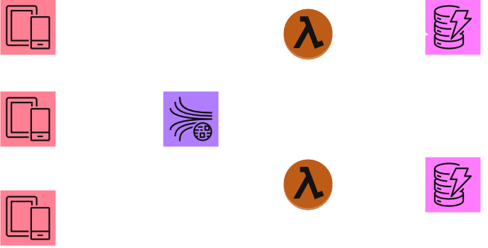
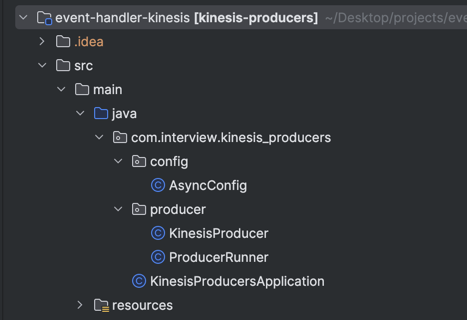
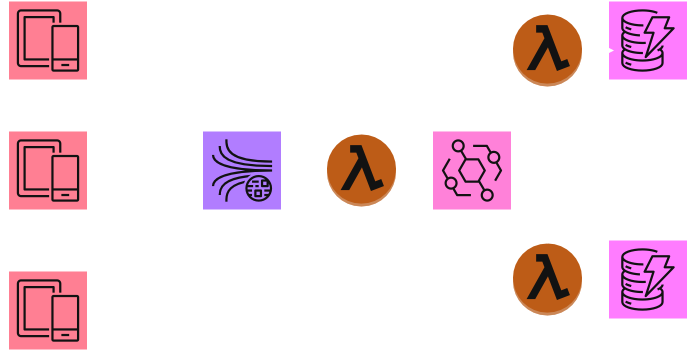
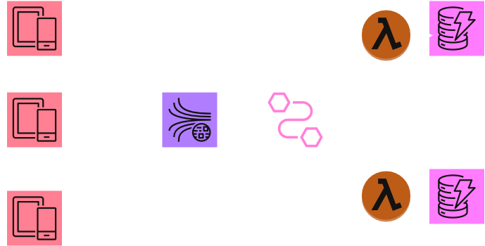
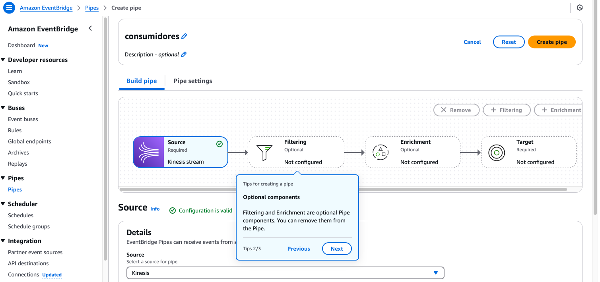

## Processando eventos em larga escala com AWS Kinesis



Optei pela arquitetura em cloud utilizando **AWS Kinesis** em vez de SQS ou Kafka devido à sua capacidade nativa de lidar com 
**fluxos de dados em alta velocidade e grande volume**. Enquanto o SQS é ideal para mensagens assíncronas individuais, 
o Kinesis permite o processamento ordenado de eventos em tempo real, com suporte a múltiplos consumidores (via *shards*), 
garantindo baixa latência e alta disponibilidade. Já o Kafka, embora poderoso, exigiria a gestão de um cluster dedicado, 
aumentando a complexidade operacional. Com o Kinesis, a AWS gerencia automaticamente a infraestrutura, 
reduzindo custos com manutenção e escalabilidade.

**Simulação de Produtores com Spring Boot Multithread**  
Para representar cenários realistas de produção de eventos, desenvolvi uma aplicação 
**Spring Boot multithread**, capaz de simular produtores enviando mensagens simultaneamente ao Kinesis. 
O Kinesis, com seu modelo de *throughput* ajustável (via aumento de *shards*), 
mostra-se resiliente frente a essa demanda, diferentemente do SQS, que tem limites mais rígidos de taxa de transferência.



**Consumo Eficiente com AWS Lambda**  
Como consumidores, utilizei **Lambda Functions** para processar os eventos do Kinesis, aproveitando seu modelo *serverless* e escalabilidade automática. Cada Lambda é acionada por um *batch* de registros e persiste os dados em tabelas dedicadas no DynamoDB, segregando logicamente os eventos por tipo ou origem. Essa estratégia não só simplifica a auditoria, mas também isola falhas — um problema em uma Lambda não impacta as demais. Comparado ao Kafka, onde o consumo exigiria *consumer groups* e balanceamento manual, o Kinesis + Lambda ofereceu uma solução mais ágil e com menos *overhead*.

**Segregação de Dados e Custo Otimizado**  
Ao salvar os eventos em tabelas separadas no DynamoDB, garanti que consultas futuras sejam eficientes e que 
políticas de retenção (TTL) possam ser aplicadas de forma granular. 
O Kinesis, integrado nativamente a serviços AWS como Lambda e DynamoDB, 
reduziu a necessidade de *glue code* complexo — comum em soluções com Kafka. 
Além disso, o custo do Kinesis é previsível (cobrança por *shard* e volume de dados), 
enquanto um cluster Kafka teria custos fixos elevados, mesmo em períodos ociosos.

**Melhorias Futuras: EventBridge Pipes para Integração Simplificada e Eficiente**


# Apache Kafka vs. Amazon Kinesis

| Categoria                 | Apache Kafka                          | Amazon Kinesis                                                                                     |
|---------------------------|---------------------------------------|----------------------------------------------------------------------------------------------------|
| Stream of records container | Topic                               | Stream                                                                                             |
| Data Stored in...         | Kafka Partition                      | Kinesis Shard                                                                                      |
| Unique ID of a record     | Offset number                        | Sequence number                                                                                    |
| Ordering under...         | Partition level                      | Shard level                                                                                        |
| **Features**              |                                       |                                                                                                    |
| SDK Support               | Kafka SDK supports Java              | <span style="background-color:yellow; color:black">AWS SDK supports Android, Java, Go, .NET</span> |
| Configuration & Features  | More control on configuration        | Number of days/shards can only be configured                                                       |
| Reliability               | Replication factor configurable      | Writes synchronously to 3 machines/datacenters                                                     |
| Performance               | Kafka wins                           | Writes each message synchronously to 3 machines                                                    |
| Data Retention            | Configurable                         | 1 year                                                                                             |
| Log Compaction            | Supported                            | Not supported                                                                                      |
| Processing Events         | >1000 events/sec                     | ~1000 events/sec                                                                                   |
| Producer Throughput       | Kafka Wins                           | Slower than Kafka                                                                                  |
| **Operações**             |                                       |                                                                                                    |
| Setup                     | Weeks                                | <span style="background-color:yellow; color:black">A couple of hours</span>                        |
| Configuration Store       | Apache Zookeeper                     | Amazon DynamoDB                                                                                    |
| Checkpointing             | Offsets stored in a special topic    | DynamoDB                                                                                           |
| Incident Risk/Maintenance | High (manual management)             | <span style="background-color:yellow; color:black">Fully managed by AWS</span>                     |
| Human Costs               | Requires human support for clusters  | <span style="background-color:yellow; color:black">Pay-as-you-go, no management needed</span>      |

*Fonte: Adaptado de [Softkraft - AWS Kinesis vs Kafka Comparison](https://www.softkraft.co/aws-kinesis-vs-kafka-comparison/)*
**Legenda:**
- **Shard**: Unidade básica de throughput no Kinesis
- **Broker**: Nó servidor no cluster Kafka

## Hands-on

```bash
git clone https://github.com/adrianobzs/event-handler-kinesis.git
cd terraform/environments/prod
terraform plan
terraform apply --auto-approve
cd ../../..
mvn spring-boot:run
```
Cheque se as tabelas do dynamoDB foram preenchidas com os eventos enviados.
Remova os recursos via terraform com o comando:
```bash
terraform destroy --auto-approve
```

## Solução Alternativa / Futuras melhorias

## Alternativa #1 - Kinesis - Lambda - Eventbridge (inviável)


O Kinesis Data Stream nao possui integracao nativa com o Eventbridge, sendo assim, nao consegue enviar o evento para um 
barramento diretamente. Faz-se necessario um intermediario, geralmente uma lambda function que faria o papel de roteador
de eventos para os consumidores/clientes.

## Alternativa #2 - Kinesis - Eventbridge Pipe (otimizada)


Como próxima evolução da arquitetura, planejo implementar **Amazon EventBridge Pipes** para orquestrar a integração entre o Kinesis e os consumidores (Lambda Functions). Essa solução oferece benefícios significativos, como:
- **Filtragem Granular de Eventos**: Com *EventBridge Pipes*, é possível filtrar registros do Kinesis diretamente na origem, reduzindo o volume de dados processados pelas Lambdas e cortando custos desnecessários. Por exemplo, consumidores específicos poderiam receber apenas eventos que atendam a critérios como `tipo_evento = "pagamento"`.
- **Transformações *On-the-Fly***: A capacidade de transformar payloads JSON em tempo real (ex.: renomear campos, enriquecer dados) antes de chegarem às Lambdas, simplificando a lógica das funções.
- **Conexões Diretas com Serviços AWS**: Além do DynamoDB, os *Pipes* podem rotear eventos para SQS, SNS, ou até mesmo Step Functions, permitindo fluxos híbridos (ex.: eventos críticos viram mensagens SQS para filas de retentativa).
- **Menor Código Customizado**: Elimina a necessidade de Lambdas "roteadoras", já que o *Pipe* gerencia encaminhamentos, retentativas e *batch processing* nativamente.



Como próxima evolução da arquitetura, planejo implementar **Amazon EventBridge Pipes** para orquestrar a integração entre o Kinesis e os consumidores (Lambda Functions). Essa solução oferece benefícios significativos, como:
- **Filtragem Granular de Eventos**: Com *EventBridge Pipes*, é possível filtrar registros do Kinesis diretamente na origem, reduzindo o volume de dados processados pelas Lambdas e cortando custos desnecessários. Por exemplo, consumidores específicos poderiam receber apenas eventos que atendam a critérios como `tipo_evento = "pagamento"`.
- **Transformações *On-the-Fly***: A capacidade de transformar payloads JSON em tempo real (ex.: renomear campos, enriquecer dados) antes de chegarem às Lambdas, simplificando a lógica das funções.
- **Conexões Diretas com Serviços AWS**: Além do DynamoDB, os *Pipes* podem rotear eventos para SQS, SNS, ou até mesmo Step Functions, permitindo fluxos híbridos (ex.: eventos críticos viram mensagens SQS para filas de retentativa).
- **Menor Código Customizado**: Elimina a necessidade de Lambdas "roteadoras", já que o *Pipe* gerencia encaminhamentos, retentativas e *batch processing* nativamente.

Essa mudança não só reduziria a complexidade operacional, mas também aumentaria a eficiência,
especialmente em cenários com dezenas de consumidores heterogêneos. A combinação **Kinesis + EventBridge Pipes + Lambda**
se tornaria um *pipeline* totalmente gerenciado, com monitoramento centralizado via CloudWatch e
custos otimizados por processamento seletivo.

## Conclusão

Apesar de o Kinesis nao apresentar uma latência tão baixa quanto o Kafka, mas marginalmente parecido, o custo inicial em
implantar a solução e sua posterior manutenção, e sua integração nativa com outras tecnologias AWS faz dele o condidato ideal,
e ainda por cima, capaz de se integrar com ferramentas de data analytics nativamente.


Fonte: [https://docs.aws.amazon.com/kinesis/](https://docs.aws.amazon.com/kinesis/)